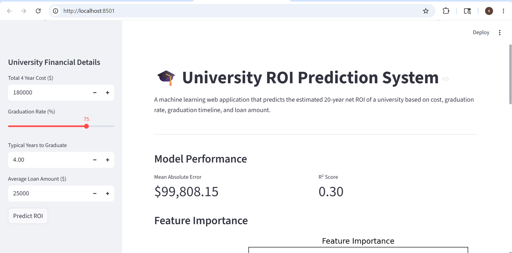
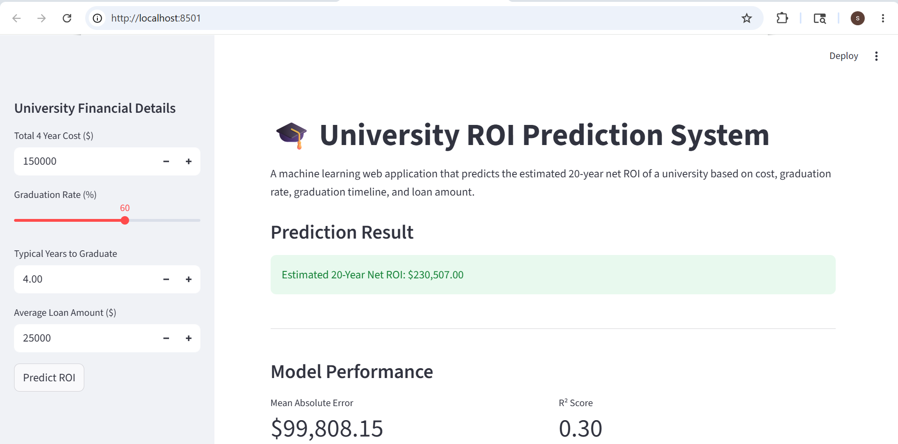

# 🎓 University ROI Prediction System

A machine learning web application that predicts the estimated 20-year net return on investment (ROI) of a university based on educational cost, graduation rate, graduation timeline, and student loan amount.

Built using Scikit-learn, Random Forest Regression, and Streamlit.

---

## 📸 Application Preview

### Streamlit Dashboard



---

### ROI Prediction Result



---

## 🚀 Features

- Predicts estimated 20-year university ROI
- Interactive Streamlit dashboard
- Real-time machine learning predictions
- Feature scaling and preprocessing pipeline
- Regression-based prediction system
- Dataset visualization
- Feature importance analysis

---

## 🛠️ Tech Stack

- Python
- Scikit-learn
- Random Forest Regressor
- Streamlit
- Pandas
- NumPy
- Matplotlib

---

## 📂 Project Structure

```bash
university-roi-prediction-system/
├── README.md
├── requirements.txt
├── .gitignore
├── app.py
├── data/
│   └── datasetROI.csv
├── assets/
│   ├── app-ui.png
│   └── prediction-result.png
└── src/
    ├── __init__.py
    ├── data_preprocessing.py
    ├── model_training.py
    ├── prediction.py
    └── visualization.py

---

## ▶️ Installation

Clone the repository:

```bash
git clone https://github.com/ShaiveSharma02/university-roi-prediction-system.git
cd university-roi-prediction-system
```

Install dependencies:

```bash
pip install -r requirements.txt
```

---

## ▶️ Run Application

```bash
python -m streamlit run app.py
```

---

## 📊 Machine Learning Workflow

1. Load university ROI dataset
2. Clean and preprocess financial data
3. Scale numerical features
4. Train Random Forest Regression model
5. Evaluate model performance
6. Generate real-time ROI predictions
7. Visualize feature importance

---

## 📈 Model Performance

- Random Forest Regression
- Feature Scaling using StandardScaler
- Mean Absolute Error evaluation
- R² Score evaluation
- Feature Importance visualization

---

## ⚠️ Disclaimer

This project is intended for educational and portfolio purposes only.

Predicted ROI values should not be considered real-world financial advice.

---

## 👨‍💻 Author

Shaive Sharma
